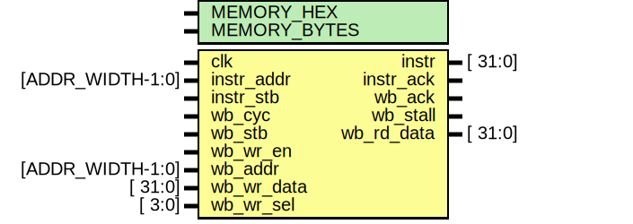
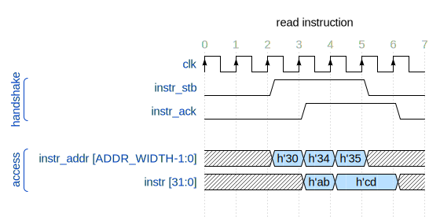
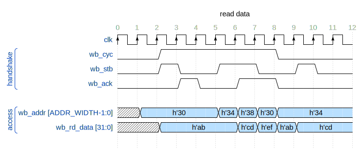
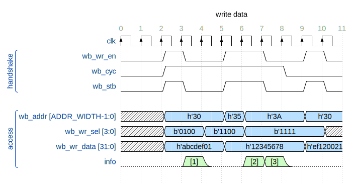

# Entity: main_memory 

- **File**: main_memory.sv
## Diagram


## Description


 ### Reading instructions from memory
 When reading from memory, ignore the last 2 bits of the address because memory is accessed by word.
 
 ``` verilog
   always @(posedge clk) begin : sync_read_process

    instr_ack  <= instr_stb;  // read ack go high next cycle after receiving stb (request)

    instr      <= memory[instr_addr>>2];  // read instruction

  end
 ```
 In the example below, passing instr_addr = h'4 (*b'100*) or instr_addr = h'5 (*b'101*) accesses the same memory slot at h'4 (*b'100*).
 
 

 ###### Data in memory:
 
 

 ### Reading data from memory
 When reading from memory, ignore the last 2 bits of the address because memory is accessed by word.

 **wb_cyc**: bus cycle active (1 = normal operation, 0 = all ongoing transaction are to be cancelled)

 **wb_stb**: request for read/write access to data memory

 **wb_ack**: only when ack = 1, **wb_rd_data** is valid
 ``` verilog
   always @(posedge clk) begin : sync_read_process

    wb_ack     <= (wb_stb && wb_cyc);  // read ack go high next cycle after receiving stb (request)

    wb_rd_data <= memory[wb_addr>>2];  // read data

  end
 ```
 In the example below, the **wb_rd_data** at **clk** = 3, 6, 7 is valid, any other data changes should be ignore.
 
 

 ###### Data in memory:
 
 

 ### Writing data to memory
 When writing to memory, ignore the last 2 bits of the address because memory is accessed by word.

 **wb_wr_en**: write enable (wb_wr_en = 1: write, wb_wr_en = 0: read)

 **wb_cyc**: bus cycle active (1 = normal operation, 0 = all ongoing transaction are to be cancelled)

 **wb_stb**: request for read/write access to data memory

 **wb_addr**: address to write

 **wb_wr_data**: data need to be write

 **wb_wr_sel**: select which byte(s) in **wb_wr_data** need to be stored at the coresponding byte slots at the address
  ``` verilog
   always @(posedge clk) begin : sync_write_process

    if (wb_wr_en && wb_stb && wb_cyc) begin

      if (wb_wr_sel[0]) memory[wb_addr>>2][7:0] <= wb_wr_data[7:0];

      if (wb_wr_sel[1]) memory[wb_addr>>2][15:8] <= wb_wr_data[15:8];

      if (wb_wr_sel[2]) memory[wb_addr>>2][23:16] <= wb_wr_data[23:16];

      if (wb_wr_sel[3]) memory[wb_addr>>2][31:24] <= wb_wr_data[31:24];

    end

  end
  ```
 
 

 [1]: Write h'--cd---- to h'30 (h'cd to h'32)

 [2]: Write h'1234---- to h'34 (h'34 to h'36, h'12 to h'37)

 [3]: Write h'12345678 to h'38
 ###### Data in memory:
 
 


## Generics

| Generic name | Type | Value | Description                  |
| ------------ | ---- | ----- | ---------------------------- |
| MEMORY_HEX   |      | ""    | Hex file to load into memory |
| MEMORY_BYTES |      | 1024  | Number of bytes in memory    |
## Ports

| Port name  | Direction | Type             | Description                                                                              |
| ---------- | --------- | ---------------- | ---------------------------------------------------------------------------------------- |
| clk        | input     |                  | positive edge triggered system clock                                                     |
| instr_addr | input     | [ADDR_WIDTH-1:0] | instruction memory address                                                               |
| instr      | output    | [          31:0] | instruction from memory                                                                  |
| instr_stb  | input     |                  | request for instruction                                                                  |
| instr_ack  | output    |                  | read ack                                                                                 |
| wb_cyc     | input     |                  | bus cycle active (1 = normal operation, 0 = all ongoing transaction are to be cancelled) |
| wb_stb     | input     |                  | request for read/write access to data memory                                             |
| wb_wr_en   | input     |                  | write enable (wb_wr_en = 1: write, wb_wr_en = 0: read)                                   |
| wb_addr    | input     | [ADDR_WIDTH-1:0] | memory address                                                                           |
| wb_wr_data | input     | [          31:0] | data to write to memory                                                                  |
| wb_wr_sel  | input     | [           3:0] | mask to write data to memory                                                             |
| wb_ack     | output    |                  | read ack                                                                                 |
| wb_stall   | output    |                  |                                                                                          |
| wb_rd_data | output    | [          31:0] | data read from memory                                                                    |
## Signals

| Name   | Type       | Description    |
| ------ | ---------- | -------------- |
| memory | reg [31:0] | Storing memory |
## Constants

| Name         | Type | Value                | Description  |
| ------------ | ---- | -------------------- | ------------ |
| ADDR_WIDTH   |      | $clog2(MEMORY_BYTES) | Address bits |
| MEMORY_DEPTH |      | MEMORY_BYTES / 4     | Memory slots |
## Processes
- sync_read_process: ( @(posedge clk) )
  - **Type:** always
  - **Description**
  syn read with clk 
- sync_write_process: ( @(posedge clk) )
  - **Type:** always
  - **Description**
  syn write with clk 
