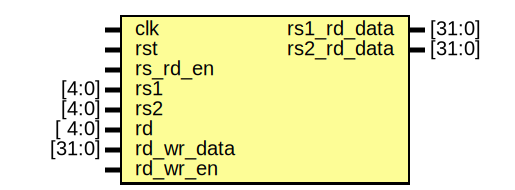

# Entity: regs 

- **File**: regs.sv
## Diagram


## Description


 The base registers in RISC-V include 32 general-purpose registers (x0-x31). These registers are used for various operations
 like arithmetic, logical, address calculations, and holding temporary data. Register x0 is hardwired to zero.
 ``` verilog
    reg [31:0] x[1:31];  //! regs from x1 to x31 (x0 is hard-wired with 0 value)
 ```
 ### Write to reg
 ``` verilog
   //! only need to write if not try to write to x0 (zero)

  wire need_write = rd_wr_en && (rd != `ZERO_REG_ADDR);


  integer i;

  //! syn write with clk and only write if Stage Writeback is preivously enable.

  always @(posedge clk, posedge rst) begin : sync_write_process

    if (rst) begin : reset_x

      // reset all base registers

      for (i = 1; i < 32; i = i + 1) begin

        x[i] <= 0;

      end

    end else begin

      // output of [Stage 5 WRITEBACK] is registered so delayed by 1 clk

       if (need_write) x[rd] <= rd_wr_data;

    end

  end
  ```
 
 

 [1]: Write to x0 so do nothing,
 [2]: Write 97 to x[04]
 ### Read from regs
 
 

 ``` verilog
   reg [4:0] r_rs1;  //! registered rs1

  reg [4:0] r_rs2;  //! registered rs2


  //! syn read with clk

  always @(posedge clk, posedge rst) begin : sync_read_process

    if (rst) begin

      r_rs1 <= 0;

      r_rs2 <= 0;

    end else begin

      // only read the register if [STAGE 2 DECODE] is enabled

      if (rs_rd_en) begin

        r_rs1 <= rs1;  // update r_rs1 so the rs1_rdata = x[r_rs1] will also be updated

        r_rs2 <= rs2;  // update r_rs2 so the rs2_rdata = x[r_rs2] will also be updated

      end

    end

  end


  // if read from x0, return 0 else return x[rs]

  assign rs1_rd_data = (r_rs1 == `ZERO_REG_ADDR) ? `ZERO_REG_DATA : x[r_rs1];  // read data from rs1

  assign rs2_rd_data = (r_rs2 == `ZERO_REG_ADDR) ? `ZERO_REG_DATA : x[r_rs2];  // read data from rs2
  ```


## Ports

| Port name   | Direction | Type   | Description                                |
| ----------- | --------- | ------ | ------------------------------------------ |
| clk         | input     |        | positive edge triggered system clock       |
| rst         | input     |        | asynchronous reset                         |
| rs_rd_en    | input     |        | source registers read enable               |
| rs1         | input     | [4:0]  | source register 1 address                  |
| rs2         | input     | [4:0]  | source register 2 address                  |
| rd          | input     | [ 4:0] | destination register address               |
| rd_wr_data  | input     | [31:0] | data to be written to destination register |
| rd_wr_en    | input     |        | destination register write enable          |
| rs1_rd_data | output    | [31:0] | source register 1 value                    |
| rs2_rd_data | output    | [31:0] | source register 2 value                    |
## Signals

| Name       | Type       | Description                                         |
| ---------- | ---------- | --------------------------------------------------- |
| x          | reg [31:0] | regs from x1 to x31 (x0 is hard-wired with 0 value) |
| r_rs1      | reg [4:0]  | registered rs1                                      |
| r_rs2      | reg [4:0]  | registered rs2                                      |
| need_write | wire       | only need to write if not try to write to x0 (zero) |
## Processes
- sync_read_process: ( @(posedge clk, posedge rst) )
  - **Type:** always
  - **Description**
  syn read with clk 
- sync_write_process: ( @(posedge clk, posedge rst) )
  - **Type:** always
  - **Description**
  syn write with clk and only write if Stage 5 ([writeback](../../../hw/rtl/writeback.sv)) is preivously enable. 
